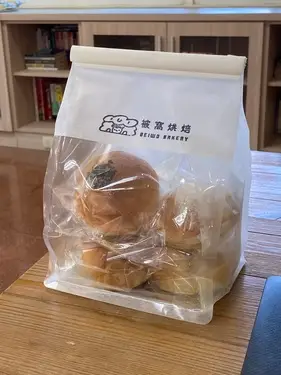
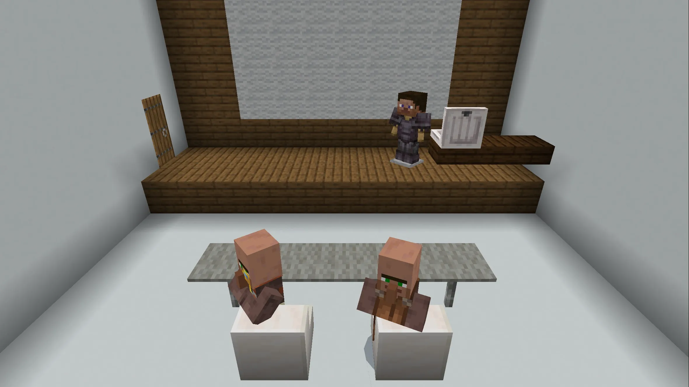
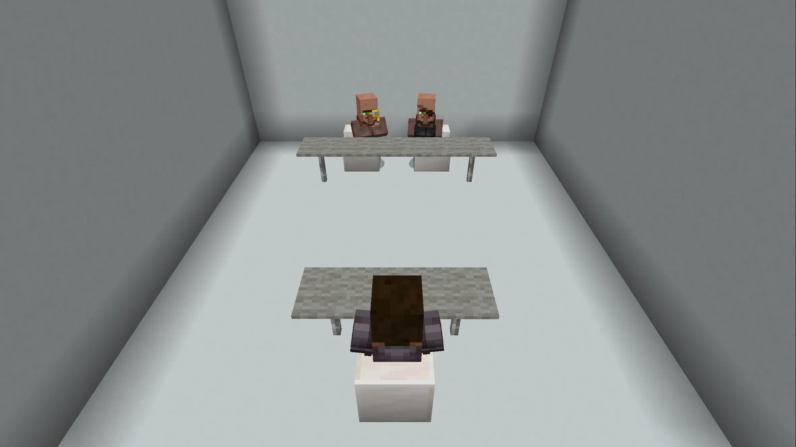

# 暨南資工 特選面試心得

## 前言

暨南大學位於南投大概日月潭附近。因為當天同時要面試逢甲跟台大，因此我母親是開車載我一起過去的。暨南的面試分為兩階段，各五分鐘。第一階段是五分鐘的簡報自我介紹加上問答，會提供筆電也可以用自己的。第二段是五分鐘的直接問答。

### 休息室

還沒輪到的人在二樓大廳休息，有桌椅、書籍、充電插頭、以及好吃的麵包餐盒。

## 面試過程

### 第一階段 - 自我介紹

因為我的自我介紹大概兩分鐘所以後面三分鐘都在問答。我是用自己的筆電，並使用 Flipper 來當藍芽簡報筆。沒想到學長很貼心我在外面等的時候就幫我把筆電拿進去教室放好了，結果藍芽就因為太遠所以斷了。雖然進去應該有連回來但我就直接用手按。

(自我介紹略)

#### 申請動機

教授：我看你的資料看不出來你是一個高中生，你看起來已經把大學要做的事情都做完了。為甚麼會想要來讀暨南？

我：我會想申請暨大是因為暨大有接很多與政府的計畫。以及包括我參與的 SICON、摩茲台灣、以及中電會都是使用暨大 OSS Planet 提供的伺服器的資源。

> OSS Planet 是暨南大學資訊工程學系的一個計畫，提供開源軟體的網站服務。  
> 但其實中電會雖然他們答應了但申請一年了暨大的機房還沒整理完。

#### SITCON 演講經驗

教授：看你有在 SITCON 演講過，他是在哪裡舉辦的？你分享的主題是甚麼？

> 這題感覺是教授丟球給我接，會這樣問應該他是知道 SITCON 每年都在中研院舉辦的。

我：SITCON 今年是在中研院的人文科學館舉辦的，我分享的主題是「從捷徑到終端機，iPhone 的程式之旅」...

#### 私下生活

教授：現在我看到的是螢幕上的你，那你平常私下的生活是怎麼樣的？

我：我平常雖然在學校比較少老師或同才能夠跟我一起討論資工相關的東西，但我積極參與中部的中電會或是 SITCON 等學生社群，透過網路連接來互相交流。

### 第二階段 - 問答

#### 程式語言

教授：看你做了很多的專案。你會哪些程式語言？學習的歷程是甚麼？

我：我一開始是因為喜歡做網頁所以開始接觸到 HTML, CSS, JavaScript，後來大部分的專案都是使用 JavaScript (Node.js) 來做開發，因為他可以做很多事。到了高中因為做更多不同面向的專案以及檢定所以也接觸了 Python, C++ 等語言。在開發專案的時候我會根據不同的情境和需求來選擇適合的語言。

#### 專案

教授：可以談談你最喜歡的專案嗎？

> 有點忘記是最喜歡還是最有挑戰性的專案了。

我：我最喜歡的專案是在仰望盃科學實作競賽。我們開發了一個手環可以透過分析你的陀螺儀變化來判斷你一整天的日常活動，同時透過蒐集心律的變化來判斷你一整天的壓力變化。這個專案我很喜歡是因為它有很多跨領域的結合，從硬體開發、網頁設計、深度學習、到學科的物理學和生物學等等，非常具有挑戰性。

教授：他可以判斷出哪些動作？

他可以判斷出 15 種不同的動作，包括走路、跑步、寫作業、投籃、羽球、網球等等。

教授：有哪些動作是特別容易判斷錯誤的？

我：最容易判斷錯誤的是運球還有跳繩

教授：(一臉問號) 是哪個運球？籃球的那個運球？

我：對，因為他們手部都是原地上下移動，的所以比較相近。但是基本上整理的準確率可以到 97% 以上。

教授：你們是使用甚麼方式來做深度學習的？

我：我們使用了 TensorFlow 來做深度學習，搭配點注意力機制以及 LSTM 來做分類。

(有點忘記後面還有沒有問題，但大概是這樣。)

## 心得

兩步驟的面試規劃不是很理解，但問題剛好都沒有重複。整理來說教授都很和善，也會問一些細節的問題，可能是想驗證我是否真的有參與過且了解這個專案。

## 後記

暨南真的很大很漂亮，放遠望去大草原後的一片樹林都是校園。從門口大概要走個半小時才能到資工系吧，難怪會有愷蛤這種山道猴。大樓很新很乾淨，報到的時候還送了包麵包，真的蠻好吃的。

車子開進去是車牌識別需要繳停車費，但報到時會給折抵券，出去前記得要先到繳費機折抵。其實也有從高鐵站到暨南的接駁車，但對我們來說不太順路。今天因為很多學校都卡時間所以大家都在調，因此實際面試有稍微延後十分鐘。面試完之後就匆忙趕回逢甲面試了。
