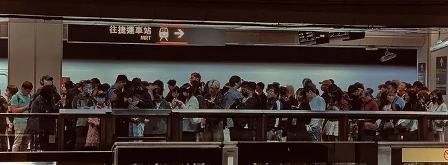

# 台大資工資安組 特選面試心得

## 前言

這是今天全台面試巡迴的第三站。因為下午的逢甲資工資安組面試提前到早上一起面完，因此有比較多時間可以慢慢搭高鐵上台北。去之前還順便回學校拿一下行動電源還有吃個午餐。雖然今天的菜色很普通，但熟悉的味道以及同學的祝福讓我安心不少。

台大資工特選沒有一般組，只有資安組。進二階的只有十個人，取三個。每個人都是電神，而且歷年來好像沒有人會放棄。

### 休息室

休息室是一間和面試間大概隔 20 公尺的會議室。走進去可以看到都是熟面孔，每個都是資安電神，大家都有說有笑的在聊天和討論面試問題。台大跟其他學校很不一樣的是除了負責報到的人以外沒有任何人會引導或是提醒你下一個是誰。要看到前一個人進去快到你時自己從休息室出去到門口等。

<!--  -->

(自我介紹略)

## 面試過程

面試總共十分鐘，前面兩分鐘計時的自我介紹，後面八分鐘問答。兩分鐘到會按一下提醒結束自我介紹，到八分鐘得時候會按一下鈴，十分鐘的時候長按鈴結束面試。

### 在校成績

我看到毛同學對於資工也有非常多的熱忱，有很多表現。那我先問一個基本的問題，就是**關於你的在校成績**物理... (略，基本上每個科目他都噴了一次)

我：確實我在高一高二的時候花比較多的精力在我感興趣的資訊工程上，所以成果比較難在成績上體現，而更多是在專案上面，比如說像是仰望盃結合物理和生物的知識來科學探究開發。那麼在高二下之後我因為準備學測考試的關係有慢慢把重心重新拉回到學習上，因此連續段考拿到最佳進步獎。

### 讀書規劃

教授：因為上大學之後，也是**有些課程不一定是跟資訊完全直接相關的，這部分未來有什麼規劃。**

我：我的規劃是把主要的時間先規劃給學業，那麼把學業完成之後剩下的時間再分配給社團或是其他感興趣的內容。_如果教授有相關的計劃的話我也會全力配合參與。_

### 漏洞回報

教授：看你有做很多跟資訊還有資安的課程，然後有特別提到說你在 ZeroDay 有回報了 45 個漏洞。**可以跟我們分享一下是用什麼方式可以大量的找到這些漏洞以及他們修正的狀況嗎？**

我：最常見的其實就是 XSS 因為是最容易被發現的。那麼 XSS 裡面比較特別的是因材網，因為它有留言區。雖然會對 JavaScript 進行過濾，但是發現如果你將 JavaScript 進行 JSFuck 編碼之後就會變成全都是看不懂的符號，然後再進行雙重的 URL 編碼其實就可以繞過他的機制。那麼也有像是其他的，比如說 XX 機車他們就是 SQL Injection 的資料庫漏洞，然後 Dcard 的話他們是輸入的邏輯漏洞，它他雖然是讓你上傳頭像，但是你其實可以在封包的 URL 裡面放任何的連結。

教授：那他們有 Follow up 嗎？

我：像是 Dcard 就是最認真 Follow up 的。提交隔天就有回覆，同時有給一些獎勵。政府機關的話也都有回應，但是如果是一些中小型企業，比如說像是龍騰文化或是一些比較小的公司，甚至是 XX 機車，雖然他的資料庫已經可以看到用戶的地址、電話等等那些都已經都是可以看得出來，但是他們是沒有做處理的。

教授：那我想接著問，那就是你發現這些漏洞，他們也不修。那你覺得以你角度來講，你覺得**他們應該採取什麼樣的措施或者你有什麼想法，可以解決這些問題。**

我：我覺得要看資安漏洞的嚴重程度，比如說像是如果是 XSS 的話，可能對於一些不是以網路為主要目的或是他只是單純放一些資訊，那可能對他們來說被攻擊的風險比較小，但是如果是已經是資料庫的外洩理論上應該要立即處理這樣。_可以看出台灣企業普遍的資安意識還是有待加強。_

### 資安 vs AI

教授：你的經歷有在交大網路安全策進會。那因為現在**資訊安全有很多 AI 或是系統方面不同領域，那這邊你有什麼額外的想法？**

我：我覺得資訊工程跟資訊安全其實是相輔相成的，像是我做很多的網頁開發會把資訊安全的概念帶回來，比如說像是從基本的 XSS 或是 SQL injection 防護，到甚至是部署伺服器的時候注意不要洩露伺服器的 ip 位置等等的。就是把這些資訊安全的概念實際把它應用到開發的專案。

你自傳有提到說結合多年的開發經驗與生成式 AI 讓你迅速掌握各種資安漏洞的特性與風險。我想要請問你說你覺得**生成式 AI 對於資安有什麼樣的幫助？或著是生成式 AI 有哪些資安的風險？**

我：先講學習的部分，因為一直以來我是自學資安的相關知識，因此很多資訊安全的概念是跟 ChatGPT 來回對話來學習。會問他說我的網站或程式可能會被那些方式攻擊，然後這樣子去認識不同的工具。在使用實際使用方面的話，其實現在可以看到很多的釣魚連結或是詐騙網站等等都會大量的使用生成式 AI。比如說他可能抓取你的社群媒體資訊然後發送假的業配信。像我常會收到那種說「我很欣賞你的某個作品」，但其實仔細看就可以發現是 AI 生成的，用這種方式來騙你去下載病毒這樣。

使用者的個資安全是 AI 生成式的一個重要議題，尤其是牽扯到醫療等敏感數據。像是如果要讓模型有很的訓練成果必定需要大量的資料，但像是麻省理工大學的教授就有在研究如何在每個人的個人資料中加入一些 noise 來保護使用者的隱私，同時保持模型的訓練效果。

同時使用者的網路指紋也是一個重要的議題，因為現在的網路指紋技術已經可以追蹤到使用者的瀏覽習慣，這樣的技術可以被應用在網路攻擊上。

### 自豪的專案

教授：聽到說你提供了 40 個實用的工具，然後有上萬人使用，**你覺得你覺得最自豪的工具是什麼？**

我：因為我是學生，所以我最有感覺的是我在高一的時候做的座位表生成器。當時會做這個專案是因為換座位要一個個抽籤很麻煩，因此製作了這個座位表生成器，三年來已經幫全台灣的學校生成超過 9000 份的座位表，所以這是我覺得特別有影響力，而且是最能直接幫助到老師和學生的專案。

### SITCON 專案分享

教授：看到你有在 SITCON 和 COSCUP 做分享，那可不可以跟我們分享一下你都分享了些甚麼？

我在 SITCON 分享的是【從捷徑終端機，iPhone 的程式之旅】。手機是我們隨時會攜帶的工具，所以和大家分享如何將我們平常 Python 或 JavaScript 的程式概念帶入手機裡面來做一些自動化，或甚至是你要怎麼用手機快速遠端連接到伺服器。這樣如果有突發事件，比如說網站突然掛了，或者是突然有什麼資安的問題可以馬上用手機來做即時的修復。

那麼在 COSCUP 的話，因為我是中電會的資訊組組長，這一年我們做了非常多的開源專案。比如說寒訓的報名網站是自己設計開發的，從報名、繳費等等流程及頁面都是自己規劃。所以我把這些專案整理出來，透過這個機會來分享給我們這一年做了哪些事，遇到了哪些問題，然後大家可以如何去使用我們開發的專案。

### 申請動機

教授：未來可以運用台大的資源去跟社群互動？

我：台大除了有全球頂尖的師資資源，同時跟產業以及其他學校有很很多密切的合作，加上有非常多學校或政府的計畫。因此十分期待可以在這裡與其他頂尖的學生一起精進，並且透過這些計畫來幫助社群。

教授：你有沒有對哪個領域特別想精進？

我：我覺得我最感興趣的應該是關於生成式手繪技術，就是深度學習的部分... (略)

(時間到鈴響)

我：大概是這樣，謝謝。

所有教授一起說：謝謝。

## 心得

台大真的是台大。教授們專業的程度真的是讓人佩服，重頭到尾都很淡定，且明顯有很認真看備審資料。問的問題都很完整有深度且都是根據你的經歷來問。每個人被問的問題差很多，其實很多地方看得出來是想要丟球給我接，但我可能就推回去沒有殺得很用力。但至少整體的氣氛是不錯的，也點醒我蠻多地方的。繼續為下禮拜的交大面試做準備。

## 後記

媽媽一整天載我從台中跑到南投、又跑到台中、再一起搭到台北，真的是辛苦很累了。台北車站高鐵南下的人潮實在太可怕了。對號座星期二就全部賣完了，自由座每個車廂排四排了不可能有位子。帶著媽媽實在不忍心讓她一路站到台中，因此決定先搭到南港再搭回來。非常感謝媽媽一整天的陪伴，也希望下禮拜的交大面試能夠順利。

