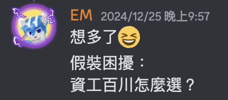

# 交大百川特選心得 - 如何錄取？百川資工怎麼選？

國立陽明交通大學百川學士學位學程是十分特別的一個科系。今年我夠過特殊選才正取錄取，因此想和大家分享我的過程心得，以及如果跟我一樣錄取了其他科系該如何選擇。

{{notice}}

也許你想看看

我的特殊選才經歷：[專案仔上交大？2025 資工特殊選才完全指南](https://emtech.cc/p/srecruit)

或著也許你也想看看 [交大資工 特選面試心得](srecruit-nycu)、[交大資安 特選面試心得](srecruit-nycu2)、或是[其他特選系列文章](/tag/特殊選才)？

{{noticed}}

## 交大百川是什麼？

交大百川是一個獨立的科系。你可以簡單理解成不分系，但是是連續四年的學位學程，不用在後面再轉到別的科系。但是你要選一個核心專業，例如電機工程、材料工程、應用數學等等，這個東西只是先幫你綁定一些必修課程，讓你在一個領域有一些基礎。而除了一些科系和學校的必修以外剩下你可以選修任何你想要的課程，不用受到系所的限制。最爽的是你選任何科系的課都會被視為系內學生（第一順位）。具體的修課規定你可以參考[官網](https://aretehp.nycu.edu.tw/?page_id=15)。

### 畢業證書

百川是獨立的科系，連續的四年學位學程。比如說就算我的專業領域選的是資訊工程，畢業的時候拿得還是百川的畢業證書。

> 我們會依照每個同學修習不同的核心課程作為畢業證書上撰寫的依據，例如選擇電機工程、材料工程為核心課程者會頒授工學士，應用數學、應用化學等核心課程者會頒授理學士。
>
> - [百川學士學位學程](https://aretehp.nycu.edu.tw/)官網

## 申請流程

百川只能透過特殊選才錄取。申請要繳交的內容跟其他科系一樣，就基本資料、自傳、讀書計劃、跟作品集等等。

### 自傳

自傳比較特別的是規定**一定要手寫**，且有字數限制。我自己是先在電腦打完排版（[Figma](https://www.figma.com/)）之後再用 iPad 使用 Apple Pencil 手寫（[Procreate](https://apps.apple.com/tw/app/procreate/id425073498)），這樣我比較習慣也比較好看。

> 自傳可以使用 iPad 手寫是我有先請學長幫我問教授，以及自己發送電子郵件確認過後才這樣做的。

### 筆試

通常是兩大題英文題，一題國文題，一大題數學題。在面試那天的早上會先考筆試，然後午餐後面試。

> 筆試的目的是為了解學生是否有基本的批判與中英文閱讀能力，這是我們認為一位準大學生所必須具備的，不需要特別準備，這種能力也很難在短期內養成。
>
> - [百川學士學位學程](https://aretehp.nycu.edu.tw/)官網

這部分我在準備的時候就是自己列印考古題出來練習，然後給老師們改。考古題在官網裡面都有。

以往的題目大多圍繞在教育理念，所以建議你可以先有一些你自己的觀點，查詢一下相關資料。同時也關心一下時事，這樣比較好下手，跟學側作文概念類似。比如說今年的題目就談到了 AI、戰爭、VR、短影音等等現在十分熱門的議題。

### 面試

{{notice}}

以前有兩段式面試但我這屆只有一次面試。

{{noticed}}

百川的面試是一對三，面試的教授會有百川的教授以及你的核心專業的教授。過程很順利，聊得很開心。不用準備簡報，不限時的自我介紹後就是問答。總共十分鐘。

我們花了點時間聊我的自傳為什麼不是紙筆手寫。教授很喜歡我的設計與字跡。

接著我們聊了一下我的部落格，從設計到技術層面。他們也好奇我未來無論是學習還是事業的規劃，以及對於議題的看法。

## 百川、資工怎麼選？

### 我的心路歷程

百川的教育理念與我十分契合，同時加上他的特殊性以及我對於跨領域整合與創新能力的追求，因此一直是我心目中最想上的科系。

不過身邊的人只有我這麼想。百川最大的問題是讀了四年之後完出來是一個四不像。你要跟一群本科系專業的競爭，無論是申請研究所還是找工作都可能會被懷疑你的專業能力。假設能力相同，本科系的根百川的你會怎麼選？更何況身邊這麼多的學長和老師，除了交大的學長以外沒有一個人真的知道百川是什麼。百川也才辦幾年，目前畢業生很少，大多數都在讀研究所或在學中，會有很大的不確定因素。

當然如果你要出國一定會比待在台灣吃香，國外普遍相對來說會更看重你真實的能力，而在台灣這個以硬體為主的小島很容易就落入錯誤的`台大>交大`，`電機>資工>不分系`。**當然如果你要出國或是自己開公司就不會有這個問題，而且聽完新生說明會看到身邊這屆的同學以及學長姐確實大多都會往這方面發展。**

總結來看，既然我明顯有對於資訊工程的熱愛與專業，並很幸運的也有錄取交大資訊工程學系。在師長、朋友、和家人的建議下我選擇了資訊工程。而我所感興趣的跨領域整合與創新能力，我可以在資工的課程中自己選修，或甚至是自學。這樣我可以在四年之後有一個更穩固的專業基礎，同時也有更多的選擇。

### 你要怎麼選？

在選擇的時候我建議你可以先查詢以下資料。在準備申請時要寫自傳以及讀書計劃也會用到。

1. **查詢百川修課規定**：你可以先看看百川的核心課程，有哪些必修，有哪些選修。這樣你可以先了解你未來四年的課程大概是什麼樣子。
2. **查詢交大課程列表**：你可以看看交大的課程列表，看看你未來四年可以選修的課程有哪些。每間學校得特色不同，像我在準備的時候就發現交大設計類以及文學類的課程相對來說比較少。
3. **網路資料**：你可以查詢一下百川的學長姐的經驗，看看他們畢業後的去向，以及他們的心得。這樣你可以對未來有一個大概的了解。這部分很有趣，我平常很少上低能卡看，但你可以看到各種人對於百川的各種不滿，像是佔名額，很多特權等等。但聽學長說實際上學校裡面並不會這樣吵，跟跨系的人講話的機會都很少了。

然後你可以從以下幾個方面來思考：

1. **未來規劃**：你未來想要做什麼？是出國？讀研究所？還是找工作？
2. **現在的科系是否符合你的興趣**：你所期待的教育理念與課程內容是否有一個科系符合？你是否有足夠的熱情去學習？
3. **自律與時間規劃**：就讀百川之後你會有很多的跨系分組報告及各種活動與課程，你是否有足夠的自律去學習？
4. **家人與你的期許**：就讀哪個科系更能夠幫助你達到你的目標？你的家人及師長有什麼看法或建議？

## 結語

以上是我的百川申請過程與心得，希望對你有所幫助。如果你有任何問題或是想要了解更多，歡迎透過下方任意方式聯絡我，或與社群及身邊的朋友、師長討論。

> 封面圖：毛哥EM 攝。百川 114 學年度新生說明會提供的茶點很好吃。
