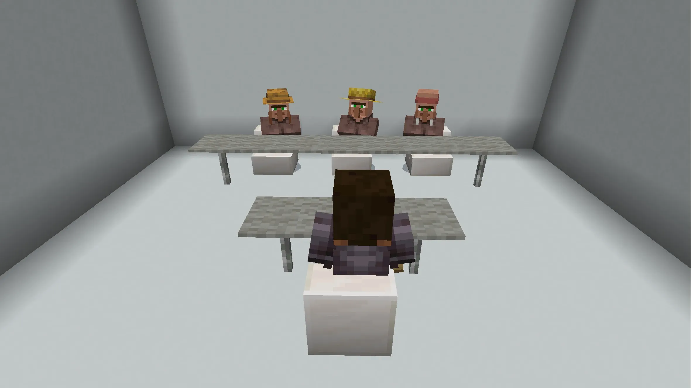

# 交大資工資安組 特選面試心得

## 前言

交大與我十分有緣份，除了認識許多學長外同時我也是 [網路安全策進會 BambooFox](https://bamboofox.org/) 的成員。這是今年特殊選才面試的最後一站，完了之後接下來就是等結果了。進去休息室在熟悉的教室，裡面都是熟面孔，大家開心地聊著天。我是少數同時有進一般組與資安組的人，所以等一下面試完資安之後還要等後面的一班組。

結果：備取 2

### 面試過程

到前幾位的時候會來抓人到門口等。每間都有門禁所以任何人出入面試教室都需要學長幫忙刷卡。整個過程 7 分鐘，包括一分鐘的自我介紹。以往的學校全部都是兩分鐘的自我介紹，所以我有特別重新準備。教室還蠻灰暗的。座位是標準的前面三個教授，距離有一點遠。有一位教授戴口罩音量較小，聽大家說都聽得有一點點吃力。

### 自我介紹

我是毛宥鈞，擅長透過科技解決生活中的問題，並在國內外競賽中獲得亮眼成績。全端開發榮獲往業界奧斯卡獎 Awwwards HM、網路維運榮獲 iThome 鐵人賽佳作、資訊安全在 HITCON ZeroDay 提交超過 45 個漏洞，包含政府機關以及 Dcard 等大型企業。

榮幸擔任中電會的資訊組組長、西苑資訊志工隊隊長、和交大網路資安策進會及竹狐資安戰隊的成員，在這一年主領超過 40 場工作坊，同時也在 SITCON 和 COSCUP 等大型年會中擔任講者。個人技術部落格每月穩定數萬流量，常收到來信詢問及回饋，協助大家決開發上的困難。

交大的資工全國第一，很榮幸認識教授與學長。他們的專業知識和學者氣質都深深地吸引我。我希望能在這裡培養學術素養，接受系統化、專業化的教育，完成我的大學夢。期許能用科技讓這世界不一樣。

### 部落格

教授:「你的部落格題材主要來自哪裡？」

我:「我的科技部落格是我從國中開始因為對科技感興趣，一直透過網路自學。然後發現網路上的中文資源對初學者並不友好，所以建立自己的科技部落格，希望可以把很多只有英文的工具或是比較少談論但重要得技術分享給大家。」

教授：「所以你是把英文的內容改寫成中文這樣嗎？」

我:「我有協助翻譯許多軟體及說明文件，但我的部落格都是原創文章，除了分享軟體也會分享一些我自己製作的工具。」

教授:「那你這個是有團隊還是就你自己的？」

我:「都是我自己做的，包括整個網頁設計開發到內容，從國二經營到現在累積超過 140 萬字。」

### 高中與時間分配

教授:「你是那個...西苑高中？」

我:「對，沒錯。」

教授:「是私立高中嗎？」

我:「不是，他是國立的。」

教授:「ok，我只是好奇，像你做這麼多事情，那你的時間怎麼夠用？」

我：「我的時間分配，通常會把大部分開發的活動在學校或是週末時間完成，回家比較完整的時間留給讀書這樣子。」

### 開源專案

(有點忘記是怎麼問的了)

我:「我有很多的開源專案，發現生活中各種的問題會希望可以用程式來解決，比如說像是我製作的座位表生成器，就是當時發現班上同學這樣子座位表每個要一個一個抽籤很麻煩，所以就做了一個工具給大家使用。兩年下來為全台灣生成超過 9000 多份的座位表。還有像是許多的套件函式庫我會協助性能最佳化、修 bug、以及說明文件翻譯和文章本地化等等。有的是中翻英有的是英翻中。

### 英文能力

教授:「但我看你就是英文成績也不是很高...」

我：「我在高一高二時間花比較多的時間投入在開源專案，所以可能能力在成績上面沒辦法這麼明顯體現，但是我的英文能力可以看到，我的多益拿到金色證書，今年英文辯論比賽拿到優秀辯士還有評審團獎。」

教授:「嗯我知道，所以你覺得學校考卷的問題在哪？是題目沒有鑑別度嗎還是...」

我:「學校的段考可能有些東西比較制式化，需要花比較多得時間下去讀。比如一定要用指定的單字，翻譯要用指定的文法等等。但我在高二下之後有漸漸把重心拉回到學習，所以連續多次的段考拿到最佳進步獎。」

### 中電會

教授：「中電會是一個什麼組織？」

我:「中電會全名是中部高中電資社團聯合會議，是全台灣最大的學生社群組織之一。我在中電會擔任資訊組組長，主要負責課程、網站開發、維運、以及資安相關工作。中電今年已經到第四屆，舉辦了很多免費課程活動與開源專案。提供課程和資源給全台灣的高中生，讓他們可以有機會學習到更多的知識。」

### 資安漏洞

教授:「那你是怎麼找到這麼多資安漏洞的？」

我:「我在開始接觸資安之前我已經在做網頁的全端開發。因為有這些經驗所以可以讓我迅速地掌握這些漏洞可能出現在哪裡，以及可能怎麼被應用。同時我也開發了我自己的工具可以讓我快速的找到這些漏洞。很多漏洞是建立在資料只有在前端做驗證，那麼這就可能出現可以上傳任意檔案跟資料的問題。所以對資訊安全也十分感興趣。」

教授：「那他們有給你甚麼獎勵嗎？」

我:「有像是 Dcard 有給我很多的贈品，有的公司會有獎金。」

### 資安競賽

教授：「那你有參加過資安的競賽嗎？」

我:「資安的競賽有參加過 EOF 還有金盾獎，但當時因為才高一，剛開始接觸到資安就去報名，所以沒有得獎。但藉由比賽的經驗學到很多的技術以及可以精進的方向。後來還有協助中電寒訓以及 AIS3 活動中出題。」

教授:「好，時間到了。這個你拿回去，我們不收紙本。」

我:「哦了解，謝謝。」

教授:「好，謝謝。」

## 後記

有點緊張，很多東西回答的沒有到最好但還算完整，整個面試的氛圍是好的。回來後和學長及朋友們繼續暢聊。
