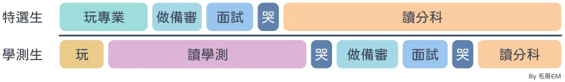

# 專案仔上台大？2025 資工特殊選材完全指南

我是毛哥EM，西苑高中的學生。平時成績普通，APCS 3 級分，沒有任何資安競賽成績，但透過特殊選材考上了台大資工，應該算是蠻特別的一個經歷。因此在現在旁邊同學努力讀學測的時候，我想透過我的親生經驗和你來分享一下特殊選材到底是甚麼？適合誰？怎麼準備？以及我的心得。如果你也想透過特殊選材申請資訊工程學系，這篇文章的參考價值絕對超過所有網路補習班的介紹。

{{notice}}
免責聲明

這裡的內容是根據我實際經驗的個人觀點，可能有些主觀，且不一定適用於所有人。
{{noticed}}

## 統計數據

我們先來看一點數字。114 特殊選才共有 59 所大學參與，核定名額達到 2,156 名。我看下來資訊工程學系的錄取率大概在 6% 左右，而且這群人全部都是資工有一定實力的人才會來特選。大多學校通常只有 2 個左右的正取名額 (交大比較特別有 10 個名額)。因此對於程式有興趣的朋友有的也會報名資安外加、資管、電機、或是不分系 (百川/清華學院) 等等。有的學校可以報多個科系 (如交大)，有的學校只能報一個科系 (如成大)。

接下來來放一下我的成績供你參考，後面我會教你要如何解讀這張圖。面試心得建議你讀完這篇文章之後再當章回小說慢慢看。

| 學校             | 科系       | 二階 | 成績       | 心得文                                                 |
| ---------------- | ---------- | :--: | ---------- | ------------------------------------------------------ |
| 國立臺灣大學     | 資工資安組 |  ✅  |            | [面試心得](/p/srecruit-)                               |
| 國立臺灣大學     | 希望入學   |  ✅  |            | [面試心得](/p/srecruit-)                               |
| 國立陽明交通大學 | 資工       |  ✅  |            | [面試心得](/p/srecruit-)                               |
| 國立陽明交通大學 | 資安       |  ✅  |            | [面試心得](/p/srecruit-)                               |
| 國立陽明交通大學 | 百川       |  ✅  |            | [面試心得](/p/srecruit-)                               |
| 國立清華大學     | 資工       |  ❌  | ❌無緣     | [面試心得](/p/srecruit-)                               |
| 國立清華大學     | 資工資安組 |  ❌  | 🌚忘記報名 | [面試心得](/p/srecruit-)                               |
| 國立清華大學     | 不分系     |  ❌  | ❌無緣     | [面試心得](/p/srecruit-)                               |
| 成功大學         | 資工乙組   |  ✅  | ❌無緣     | [上機考題目](/p/srecruit-), [上機考插曲](/p/srecruit-) |
| 國立中山大學     | 資工       |  ❌  | ❌無緣     | [面試心得](/p/srecruit-)                               |
| 國立中央大學     | 資工       |  ❌  | ❌無緣     | [面試心得](/p/srecruit-)                               |
| 國立暨南國際大學 | 資工       |  ✅  | ✅正取 2   | [面試心得](/p/srecruit-)                               |
| 臺灣師範大學     | 資工       |  ❌  | ❌無緣     | [面試心得](/p/srecruit-)                               |
| 臺灣師範大學     | 資工資安組 |  ❌  | ❌無緣     | [面試心得](/p/srecruit-)                               |
| 臺灣師範大學     | 不分系     |  ❌  | ❌無緣     | [面試心得](/p/srecruit-)                               |
| 中原大學         | 資工       |  ✅  | ✅正取 1   | [面試心得](/p/srecruit-)                               |
| 逢甲大學         | 資工       |  ✅  | ✅正取 1   | [面試心得](/p/srecruit-)                               |
| 逢甲大學         | 資安       |  ✅  | ✅正取 2   | [面試心得](/p/srecruit-)                               |
| 天主教輔仁大學   | 資工資安組 |  ✅  | 🟡備取 2   | [面試心得](/p/srecruit-)                               |

## 特殊選材是甚麼？

特殊選材你可以理解是把其他人學測後要做的事搬到前面來一起做。就是做備審，面試，放榜，然後讀分科。當然，在中間任何地方都有可能會有人提前上岸 (如特選、繁星上了) 或是學測結束做完「落點」分析之後決定 +365 或人生重新開局。也有人是 +365 之後隔年又繼續特選上頂大的。

特殊選材絕對不只是在比競賽或檢定成績。如果你只是一個 APCS 4 級分，會做 Discord Bot 的高中生那你其實應該把它做成學習歷程檔案，考學測，然後去申請 APCS 組。成績好的，比賽優秀的到處都是。要能夠在如此競爭的環境中脫穎而出你要找到你自己的特點是甚麼？自學能力？團隊組織能力？學業跟興趣兼顧？你得找到你的核心價值才能讓教授印象深刻。

### 學校在找怎麼樣的學生？

這個計畫一開始是為了自學生、實驗班以及弱勢族群創立的，但會被人罵所以也加入了「特殊才能」這個資格。

特殊選材主要的玩家分為兩種：

- **單一領域有出眾能力表現：** 如國際科展、競賽。這些人技術夠強，不用考學測。
- **科學班/資優班的學生：** 如一中科學班。這些人成績夠強，不用考學測。

雖然有的學校特殊有不同教育資歷 (中低收、境外臺生、新住民) 就符合報名資格，甚至是提供有保留名額，但建議把這個當作 buff 就好。如台大的希望入學雖然在簡章直說要招收成績考不上台大的人，但也是要看你有希望，又不是貧困入學。就算你是父母雙亡的低收原住民，如果你沒有特殊專長，要申請資工之類的熱門科系也很難被錄取。

> 今年中山資管雖然有不少人報名，也有幾個人進二階面試。儘管這些人學業成績很好 (系排一) 且也有特殊專長 (國際證照、專案開發、社團參與)，但不知道是成績單不見了還是怎麼樣，最後都沒有人錄取。
>
> 中字輩大學☕

都叫特殊選材了，教授要的不只是你的成績，更是你這個人。人格特質跟你的競賽獲成果是一樣重要的。不過每間大學要的人都不太一樣，以下是我申請這麼多學校以及學長、朋友的經驗總結下來得到的心得。大學可以分成三種：

#### 成績好的多的是！給我來點特別的

這種學校從頂大、普通國立大學、到私立大學也都有。頂大要成績好的，學測隨便抓一把都是。那麼他要看的是你有沒有學習的能力，是不是一個可朔之才，有沒有未來。

#### 我可是國立大學，我只知道在校成績

比賽是甚麼？沒聽說過。這種學校常見於中字輩。看我的統計可以看出來因為我的在校成績偏的很嚴重，所以二階面試都沒進。聽有進的朋友說有教授連[少年圖靈](https://www.tw-ytp.org)是甚麼都不知道。

你可以看出申請大學是在和教授互相摸索對方的價值觀。每間學校在意的點，發展與學習的方向其實差很多。因此你絕對不能簡單地排列頂大最好，私立最爛等等。你要根據你自己的特質，需要甚麼資源來找適合你的學校。

#### 拜託你來讀我們><

聽說有的私立大學的二階面試根本不是為了篩人，只是為了讓教授有機會可以推銷自己的學校。但不知道是我面試的學校覺得我不可能會去還是怎麼樣，所以我是沒有遇到過。

在排榜單的時候教授會考慮到你會不會來讀。比如說私立大學取到備取十幾二十都是正常的，那麼把程度好的學生放在正取，他明明不打算來讀但又很渣每間學校都按同意報到，那麼反而會占了真正想讀的名額。

同時教授也會考慮會不會有重榜的問題。像是逢甲大學面試的時候就是直接問我想去資工還是資安，最後我選資工所以是資工正一、資安正二。_總要讓別人也感受一下正取一的快樂嘛~_

### 我適合特殊選材嗎？

如果你：

- 不想讀書，成績爛，然後抱怨亞洲教育學這些沒意義的東西。
- 不知道未來要幹嘛，覺得自己甚麼都做不好。
- 覺得死了之後甚麼都帶不走，找不到活著的意義。

那麼你需要的不是自學或是特殊選材，你需要的是去輔導室或是心理諮商。

如果你：

- 不想考學測。
- 一堆科目被當，幾乎畢不了業。
- 因為玩 Minecraft 開始建模組或伺服器因此開始學程式。
- 買了一堆沒用的網域。
- 屬於 LGBTQ+ 或是[福瑞](/p/furry-intro)等群體。
- 長得有資安臉 (授說意思是在各活動都看到的熟面孔)。

那麼恭喜你符合了許多特選大佬的共通特質，可以考慮試試特殊選材。

以上是有點開玩笑，幫你翻譯一下。你要認識你自己，清楚知道你自己喜歡甚麼，想要甚麼。你願意在你感興趣的專業領域投入大量的時間，並能夠正常社交，參與相關的社群活動。如果你符合以上條件，那麼你可以考慮試試特殊選材。

## 如何準備特殊選材？

這裡我講的都是資訊工程科系。如果你要申請其他科系可能會稍微有點不同，建議可以再找老師或是學長請教。

### 讀書

> "Academics are board and hard, but you can be harder. Fxxk it and make it pregnant."  
> --全國高中英語辯論比賽評審 Caleb M. Yang (2024 @SYSH)

雖然叫做特殊選材，但是每間學校其實都會跟你要你的在校成績。像有的中字輩大學是直接把成績單放在資料第一面，所以你還是要好好讀書。至少維持在中上的水準，不要讓自己的成績太差，不然會跟我一樣在面試的時候被問，或是直接被中字輩大學或清大在一階刷掉。

### 提前規劃

建議各位在高一的時候就要先設好幾個目標學校，去看看當時最新的簡章要的比賽檢檢定。這裡隨便列出幾個常見的：

- APCS (4 級分以上會比較穩)
- 全國科展
- 奧林匹亞程式競賽
- AIS3 (資安組)
- MyFirstCTF、EOF 等 CTF 競賽 (資安組)

這些比賽檢定一年就那幾個時間，所以你要提前規劃好。科系

- 資工：覺得 APCS 太簡單的競程仔
- 資安：上不了資工的人
- 資管：上不了資工的人

{{notice}}
競程是甚麼？

競程就是程式競賽的簡寫，就是在寫考卷用程式解數學應用問題。如果你對於寫考卷、製作計算機或是寫底層演算法十分熱愛的話，那麼你應該會喜歡競程。
{{noticed}}

但規則是可以打破的，你在高二接觸到各種領域的時候你應該就能蠻確定你是不是痛恨 APCS 了。如果你跟我一樣對於競程真的沒興趣的話你也可以往以下幾條路走。

- 去讀學測
- 用專案證明你的程式、資安能力
- 打 CTF 資安競賽

不過這些你就會需要搭配你的文案、面試技巧來包裝，證明你是有淺力的。

### 準備備審

### 準備面試

### 等待

> "Patience is key in life. YKWIS?" -Jared McCain
> 「耐心是人生的關鍵。懂嗎？」

## 感想

> 等你是個咖，才有資格掉眼淚；
> 對自己沒有信心的時候 就大聲唸得獎感言。-《影后》

這篇文章其實是在十一月底寫的。特選的這個月十分的煎熬，你要一邊做備審，一邊面試，一邊看著落榜的成績。其他人都在拼命的讀書，但我完全無法靜下心來，滿腦子都是下個學校甚麼時候放榜？被教授問要怎麼答？萬一都沒上是不是得拚指考...

因此我決定提早先寫完感想文來整理調適自己。這篇文章的編輯 commit 歷史都在，如果到時候我是小丑都沒上的話那你可以看看我是怎麼改的，反正就逗大家一樂。

### 特別感謝

我從國一就下定決心要走特選這條路。不知道是在學業十分競爭的校園環境想要找到一條出路，還是當時天真的不知道人外有人。只知道這條路是我想走的，而我從來沒有後悔過。因為這條路讓我結交了許多好朋友，遇到了需多貴人，也讓我更了解自己。

<<<<<<< HEAD

- **感謝衛道中學圖書館的郭艾倫主任、梁老師，以及班導李若薇老師**，謝謝你們的悉心照顧與包容，讓我能夠無後顧之憂地追尋自己的熱情與夢想，走出屬於自己的道路。

- **感謝西苑高中圖書館的曾九芳主任、林彥呈主任、謝麗雅老師、張祐慈老師、陳永錚老師，以及劉洲榮校長與王雅駿老師**，謝謝你們的信任與支持，給予我無數寶貴的學習資源與實踐機會，讓我能實現自己的創作，並將其化為幫助他人的力量。
- **感謝符德馨老師與賴怡旬老師**，謝謝您們無怨無悔地投入大量時間陪伴我準備備審資料並練習面試，讓我能以更自信、更沉穩的姿態迎接未來的挑戰。
- **感謝 [Sean](https://www.sean.taipei/)、[ching367436](https://blog.ching367436.me/)、[Curious](https://curious-lucifer.netlify.app/)、瑞樹、炎火山、[PT](https://about.ptchen.tw/)、[Pan](https://pan93.com/)、[Chung](https://cbjsprogramdiary.com/) 學長**，無私地分享你們的經驗與建議，讓我能夠少走許多彎路。
- **感謝[奕其](https://github.com/iach526526)、[颉文](https://shellwen.com/)、[Winston](https://github.com/winstonsung)、Riley、Ivan、YuevUWU、以及其他社群的朋友們**，在我精神狀況十分抽象的這段過程，是你們陪伴我走完最後的這一哩路。
- **感謝我的父母**，從小到大始終如一地呵護著我。在您們的愛與關懷中，我得以無憂無慮地學習與成長。

# 礙於篇幅無法將每一位幫助過我的人逐一提及，但我由衷感謝每一位出現在我生命中的貴人。

- **感謝衛道中學圖書館的郭艾倫主任、梁老師，以及班導李若薇老師**，謝謝你們的悉心照顧與包容，讓我能夠無後顧之憂地追尋自己的熱情與夢想，走出屬於自己的道路。

- **感謝西苑高中圖書館的曾九芳主任、林彥呈主任、謝麗雅老師、張祐慈老師、陳永錚老師，以及劉洲榮校長與王雅駿老師**，謝謝你們的信任與支持，給予我無數寶貴的學習資源與實踐機會，讓我能實現自己的創作，並將其化為幫助他人的力量。

- **感謝符德馨老師與賴怡旬老師**，謝謝您們無怨無悔地投入大量時間陪伴我準備備審資料並練習面試，讓我能以更自信、更沉穩的姿態迎接未來的挑戰。

- **感謝我的母親**，從小到大始終如一地呵護著我。在您的愛與關懷中，我得以無憂無慮地學習與成長。

- **感謝 [Sean](https://www.sean.taipei/)、[ching367436](https://blog.ching367436.me/)、[Curious](https://curious-lucifer.netlify.app/)、瑞樹、炎火山、[PT](https://about.ptchen.tw/)、[Pan](https://pan93.com/)、[Chung](https://cbjsprogramdiary.com/) 學長**，無私地分享你們的經驗與建議，讓我能夠少走許多彎路。

- **感謝[奕其](https://github.com/iach526526)、[颉文](https://shellwen.com/)、[Winston](https://github.com/winstonsung)、Riley、Ivan、YuevUWU、以及其他社群的朋友們**，在我精神狀況十分抽象的這段過程，是你們陪伴我走完最後的這一哩路。

礙於篇幅，無法將每一位幫助過我的人逐一提及，但我由衷感謝每一位出現在我生命中的貴人。

> > > > > > > 92ec3837fb47f89459151e05457512ee2f05eb65

### 總結

希望這篇文章能夠幫助到還在猶豫，或是已經決定要特選的你。雖然我沒辦法帶你上車，但既然這條路我走過，希望能幫你把雜葉撥開，留點指引給你。特選是一條漫長未知的路，但既然走了就要走到底。我希望你能知道你並不孤獨，如果有任何問題歡迎可以在中電會交流群或是我的 Discord 伺服器提出。

> 「我們要把一件事做到至少 80 分，每件事情 60 分是不會有結果的。」-怡旬老師
