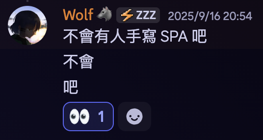

# 特選完半年的暑假在幹嘛？

我的大學申請到 1/8 號交大放榜之後就到一段落了，距離開學 9/1 之前有將近半年的時間。這段時間我做了什麼呢？稍微自己來回顧一下。

## 考無線電

因為看大家都在努力讀學測，所以我想說我也來找個題來刷好了。學測當天可以跟大家一起考試，所以就跟 Each Chen、Riley、三哥哥幾個朋友一起去 NCC 考了三級業餘無線電執照。同時也是因為 SITCON 所使用的無線電需要有證照才行。

然後到了七月：

接著就是一個「笑死，走啊」，八月我們就去考了二級。你問我考來幹嘛...額...就你會有一個二級的呼號，很帥，對。~~然後你就可以歧視只有三級還有一直非法使用的老人。~~

認真來說二級可以解鎖台灣所有開放使用的頻率、用更高的瓦數。使用短波基本上能全球免費通訊了。

不過你問我為什麼不傳訊息就好？

因為這很帥。而且交大一些地下室和角落的訊號爆爛。同時還有一次用到無線電是在文博排隊很久，好奇工作人員在討論什麼。這時我就拿對講機掃頻一下，就可以聽到他們在那裡罵一些人都在滑手機一直不往前走。如果你搭公車或巴士也可以聽聽看司機們在聊什麼，像是 Each 開高速公路時有聽到他們在講國道上面出現一隻烏龜，挺有趣的。而且我們在台灣欸，天災人禍那麼多，網路要麼被 DDoS 要麼斷海纜，還是備著比較好。

## 出車禍

然後額，我在 1/25 先出了個車禍。事情是這樣的：

我那天在教會有敬拜團服事，正打算走去搭公車，結果綠燈過馬路時被右轉的機車撞飛出去。看錄影我好像當下反射做了個護身（畢竟沒事都在從樓上往下跳），不過還是有撞到腦出血。不過還好因為這樣所以傷得比較均勻，照 MRI 腦子像是有很多小行星一樣很多地方的有出血，不然差點要做開顱手術。

> BTW 我當時包裡有一大堆奇怪的東西比如說額，對講機。

那兩天我幾乎完全記不得發生什麼事，整個月很多事我也不記得。這次經驗讓我體會到人腦是一個多麽不能信任的儲存體。跟硬碟差不多，切記重要資料要進行異地備份。

老師說通常高三下壓力在或是太嗨很容易出事，真的要特別小心。

## 寫心得

我面試過的除了資工來不及寫以外其他都幾乎是逐字稿等級的紀錄。除了當日記紀錄也希望能供學弟妹參考。

> 標籤：[特殊選才](https://emtech.cc/tag/%E7%89%B9%E6%AE%8A%E9%81%B8%E6%89%8D)

## 英文辯論

我花了很多的時間在打英文辯論。分別是師大的英辯、還有去美國比的 NSDA。花了蠻多時間在準備的，中間還打了不少小比賽來當練習和休閒娛樂。

> 延伸閱讀，這裡是幾篇我有寫成文章的：
>
> - [去美國辯論差點發生槍擊案？NSDA 2025 心得](https://emtech.cc/p/nsda2025/)
> - [打了三年師大英辯的心得](https://emtech.cc/p/debate-ntnu/)
> - [用 Discord 的線上國際辯論比賽？Taiwan WSDC 心得](https://emtech.cc/p/debate-twwsdc/)
> - [2025 忠信英文辯論邀請賽心得](https://emtech.cc/p/debate-chungHsin/)

## SITCON

沒有參加 SITCON 2026 我覺得是非常正確的決定（籌備時間是前一年八月開始到隔年三月），除了我出了車禍進度會有問題以外，九月到十二月真的是忙到爆的時間點，因此我也是非常建議高三生可以慎重考慮各種活動。

不過雖然沒有當工人，還是有講一個議程：[前端特效，不都國中數學](https://sitcon.org/2025/agenda/aa71e5/)。

> 延伸閱讀：[SITCON 2025 心得與 Q&A](https://emtech.cc/p/SITCON-2025/)

因為車禍的關係我試講前一天下午才開始做簡報，還好最後有趕出來，反應也很不錯。

BTW [我做了一個網頁](https://g.elvismao.com/slides/) 放我近期公開的簡報讓大家下載。

## SITCON Camp

不過既然特選結束了就可以來認真準備 SITCON Camp 了。我們寫了很酷的系統，在那五天玩的非常開心。

> [SITCON Camp 2025 - 連續五天的黑客松，我們搞出了一套股票博弈系統！](https://emtech.cc/p/SITCON-camp-2025)

## 考駕照

成年了當然要考駕照，這樣之後趕時間比較方便，也可以載家人朋友出去玩。

我想說接下來開學之後應該就各種忙了，最好暑假先考好。沒想到暑假的人爆多，最後是開學前一週才考到。建議可以學期中就先去上課。學費可能會比暑假便宜。

### 機車駕照

因為家裡沒有人有機車所以我其實沒有騎過，因此我是有報機車駕訓班的。沒想到第一次上車學會發動，開完一圈就完全過了。讓我當下覺得我繳這五千塊是盤子。我是無聊到直線七秒看能夠騎多慢，應該是到 17 秒多，因為以防你不知道，他超過 15 秒之後就不會數了。不過駕訓班會幫你把一些流程跑完，有車借你練習，場地就是考場，然後筆試到山上的監理所還有專車接送，其實也不錯。

考試當天沒想到前後的人直線七秒都沒過，而且這是可以重考一次的，他們連往前走都不行。現在年輕人喝酒這麼嚴重的嗎？這種真的先不要放上路比較好。

### 汽車駕照

汽車駕照我覺得真的需要去駕訓班。然後建議選手排這樣兩個都能開，難度也沒差多少。不過汽車駕照我覺得很不簡單，比機車難多了。有非常多細節，少一個方向燈少一個左右查看你就可以下車了，需要努力練習。很幸運我遇到的教練很專業教的很好，我也花不少時間練習所以一次就過了。通常暑假一次過得人只有 1/3。

汽機車我是同時上課，時間是 7:00 - 8:00 開車，機車有時候 6:00-7:00 有時候 8:50-10:40。不過我機車基本上大部分都翹掉沒去。

## emfont

emfont 是我高二開始的一個開源專案，是一個免費的中文網頁字型服務。除了讓你可以在網頁中使用漂亮的字體以外，同時很多人也是做簡報或是灌系統想找好看免費開源字體的好地方。

這上半年和 Each Chen 修了很多 Bug，進行了很多大更新。

> 延伸閱讀：奕站 - [emfont-中文開源網頁字型解決方案](https://www.iach.cc/free-webfont/)

## 學習 & Side Project

平常有零散的時間做一些小的專案和學些新東西。像是今年我學會了 Astro，然後在大大小小的專案都使用它。現在我可以告訴你，動態網頁別用。就是你有按鈕，要互動的。基本上你就是在寫純 HTML。如果你想寫成 SPA 動態網頁會很恐怖。

## 運動

暑假兩個月我報了泳訓，是在我家附近的泳池。裡面其實都是國小國中生，不過年輕人體力都很好我在國中生裡面還算慢的。平日基本上每天都會去游個一兩公里，體力感覺有進步不少。正好開學之後體育課直接就先是游泳，所以特別輕鬆。

游泳真的是很不錯的運動，除了能鍛鍊心肺功能和全身的肌肉之外，我發現他是一種唯一的極限就是你的體力的運動。就是你在冰水裡你沒辦法嫌熱，動起來唯一的阻力是水阻，又不容易受傷。這兩個月雖然 25 公尺還是要游個 16 秒，~~不過我對於水質的品鑑進步了不少~~。

## 其他雜事

當然其他還有各種有的沒的雜事，像是幫同學做備審練習面試、接點案子賺下一學期的生活費、整理屋子、整理硬碟、[換 MacBook](https://emtech.cc/p/win-macbook/) 等等有的沒的。不過最重要的還是陪伴家人度過最後的時光，畢竟接下來週末才回來一次，~~他們得自己洗碗倒垃圾了~~。

這一段時間是你少數稍微沒有壓力，可以幹大事的時間。不管你想要做什麼 project、學習知識、去打工、出國玩、或是好好休息，希望你都能度過充實的半年。
