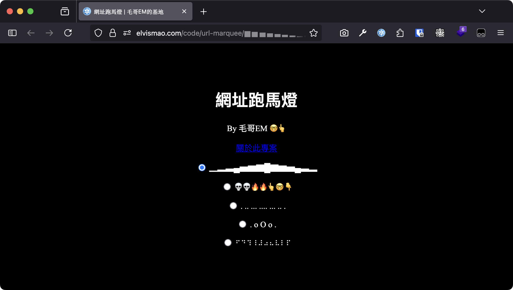

# 來用網址放跑馬燈吧！

最近常常在寫 SPA 網頁（Single Page Application），意思是說整個網頁從頭到尾沒有重新載入過，所有的內容都是用 JavaScript 動態載入的。更新網頁的內容很好理解，只需要改變 `innerHTML` 或是 `textContent` 就可以了，但是如果要改變網址列的網址呢？這時候就要用到 [History API](https://developer.mozilla.org/en-US/docs/Web/API/History_API) 了。

```js
history.pushState(state, title, url);
```

這樣我們就手動把網址列的網址改掉了，同時瀏覽記錄會被新增一筆。同時還有另外一個語法：

```js
history.replaceState(state, title, url);
```

這個語法則是把目前的瀏覽記錄改掉，不會新增一筆。

欸這時我就想了，如果我瘋狂不停地改網址，那這樣不就可以做出一些動畫效果了嗎？於是我就打開筆電寫寫看：

```html
<script>
	const text = "💀💀🔥🔥👆🤓👇";
	const chars = Array.from(text);
	let i = 0;
	setInterval(() => {
		const rotated = chars.slice(i).join("") + chars.slice(0, i).join("");
		history.replaceState(null, "", "/" + rotated);
		i = (i + 1) % chars.length;
	}, 200);
</script>
```

喔！成功了！


然後我又試了幾個不同的效果：


放在毛哥EM的基地你可以去玩玩：

<https://elvismao.com/code/url-marquee/>



雖然這個功能除了讓我瀏覽紀錄出現一堆怪東西以外沒什麼實際用途，但至少讓我等第三班國光候補不那麼無聊。

> 最近太忙兩個月沒發文章了，來水一篇。
