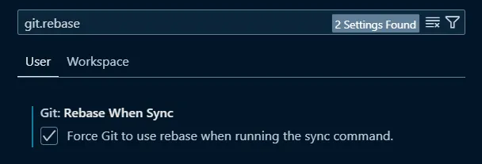

# 如何設定 VSCode Git pull 使用 rebase 而不是 merge

## Git pull 的兩種策略

在 Git 中，`pull` 指令可以讓你下載專案最新的版本，並且將遠端分支的提交歷史合併到本地分支中。這可以分成兩種策略：`merge` 和 `rebase`。

- `merge`：先讓你們分別 `commit` 各自的修改，然後再將這些修改合併在一起。
- `rebase`：先把遠端分支的修改下下來，然後把你的更改加在後面。

用圖片來說明，你可以看到全部都是我一個 commit、GitHub Actions 一個 commit。後面都是使用 `rebase`，所以歷史是漂亮的直線，但是前面的歷史就變成有一堆小分支，而且明明中間也沒有別的東西就只是彎來彎去。


雖然以前的我覺得一堆的分支這樣彎來彎去彩色燈條很漂亮，但其實講白了就是亂。因此我們可以設定 `pull` 使用 `rebase` 而不是 `merge`。

## 如何設定

### Git 設定

在一般的 Git 設定中，我們可以設定 `pull.rebase` 為 `true`，這樣每次 `pull` 就會使用 `rebase` 而不是 `merge`。

```bash
git config --global pull.rebase true
```

### VSCode 設定

不過 VSCode (Cursor) 中的 GUI Git 並不會管你的　Git config。我們可以進到設定把 `git.rebase` 為 `true`，這樣每次 `pull` 就會使用 `rebase` 而不是 `merge`。



## 結論

這樣設定之後，我們每次 `pull` 就會使用 `rebase` 而不是 `merge`，這樣歷史就會變成漂亮的直線，而不是一堆小分支彎來彎去。

