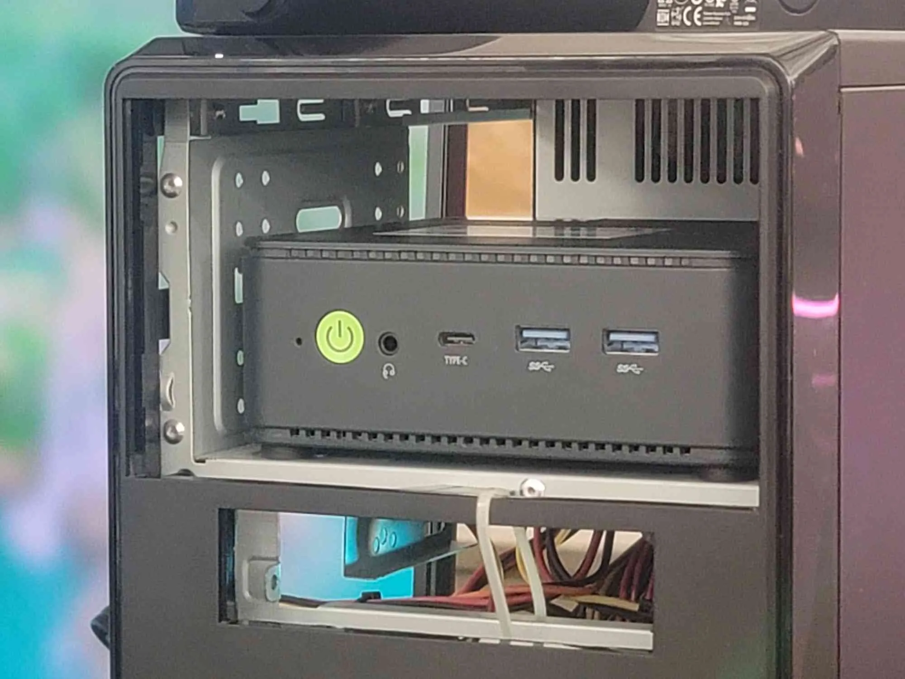

# WSL 無法更新？如何在 Windows 安裝 Docker

在 Windows 上安裝 Docker 是一個困擾我至少三年的問題，中間會遇到各種系統設定、版本更新問題。現在終於解決了，這裡簡單記錄一下我的安裝過程。


## 甚麼是 Docker

以防你不知道，如果別人給你程式你要跑起來要裝各種有的沒的很麻煩，不如直接要他的電腦 (Docke Image) 來跑，這樣就不用擔心環境問題了。同時如果它有問題，你也可以直接刪掉重裝，不會影響到你的電腦。



## 如何安裝

{{notice}}

### 我的電腦可以安裝嗎？

現在不管你是家庭版、專業版、企業版都可以安裝，只要你的電腦支援虛擬化技術和系統版本夠新。完整系統要求可以參考 [官方文檔](https://docs.docker.com/desktop/windows/install/#system-requirements)。

{{noticed}}

### 開啟虛擬化

首先你要確認你的電腦支援虛擬化技術，這個在 BIOS 裡面可以設定，不同的電腦廠牌設定方式不同，你可以參考你的電腦廠牌的說明文件。你可以在工作管理員 ( `Ctrl` + `Shift` + `Esc`) 的效能頁面看到虛擬化是否開啟。


### 安裝 WSL2

> 如果你比較喜歡 Hyper-V 的話你也可以裝 Hyper-V，各有優缺點。

如果你是安裝完 Docker Desktop 之後跳出 WSL 沒有安裝或是更新錯誤，那你可以跟著我一起安裝 WSL2，不用刪除剛剛當掉的 Docker Desktop。

你會需要安裝最新版本的 WSL2。如果你已經安裝過了但需要更新，你可以嘗試打開 Docker Desktop 讓他自己更新，或是使用 `wsl --update` 來更新。如果 Microsoft Store 一如既往的擺爛你可以用我下面的方式來安裝。

#### 使用指令安裝

這是理想的狀態。如果你從來沒有安裝過的話你可以直接在**系統管理員模式**中開啟 PowerShell 或 Windows 命令提示字元來從 Microsoft Store 安裝。

按下 `win` + `x` 選擇 Windows PowerShell (系統管理員) 或是 Windows 終端機 (系統管理員)。然後輸入以下指令。

```powershell
wsl --install
```

#### 手動安裝

如果你跟我一樣安裝失敗，或是更新失敗，你可以跟我一樣直接去官方 GitHub Release 下載安裝。

##### 1. 關閉 Windows Subsystem for Linux

在鍵盤中按下 `win` + `r` 開啟執行，然後輸入 `optionalfeatures` 並按下 Enter。在功能視窗中找到「Windows 子系統 Linux 版」 (Windows Subsystem for Linux)，取消勾選並按下確定。


##### 2. 安裝 WSL2

到 [WSL 的 GitHub Release 頁面](https://github.com/microsoft/WSL/releases/) 根據你的系統下載最新版本的 `.msi` 安裝檔，然後執行安裝即可。


如果你還有遇到別的問題，如空間不足等等，可以參考 Microsoft 的[針對適用於 Linux 的 Windows 子系統進行疑難排解](https://learn.microsoft.com/zh-tw/windows/wsl/troubleshooting#installation-issues)。

### 安裝 Docker Desktop

進到 [Docker 官網的下載頁面](https://docs.docker.com/desktop/setup/install/windows-install/)直接選擇你的系統版本下載即可 (通常應該是 `x86_64`)。

下載完成之後一路下一步就完成囉。如果看到類似這樣的畫面就代表兩個都安裝成功了。不會跳出錯誤視窗，左下角會寫 Engine Running。


## 測試

接下來你就可以正常使用 Docker 了，你可以打開 PowerShell 或是 Windows 終端機來測試。

```powershell
docker --version
```

這裡我測試跑了看看可以自架的音樂串流服務 Navidrome。首先先在任意目錄下建立一個資料夾，然後在資料夾中建立一個 `docker-compose.yml` 檔案。

```yaml
services:
    navidrome:
        image: deluan/navidrome:latest
        user: "1000:1000"
        ports:
            - "4533:4533"
        restart: unless-stopped
        environment:
            ND_SCANSCHEDULE: 1h
        volumes:
            - "C:/Users/user/Desktop/docker/data:/data"
            - "C:/Users/user/Music:/music"
```

同個目錄裡面建議一個 `data` 資料夾，然後在 `Music` 資料夾裡面放一些音樂檔案。然後在 PowerShell 或是 Windows 終端機中進到這個目錄，然後執行以下指令。

```powershell
docker-compose up -d
```

需要等待一段時間讓它完成下載跟安裝。如果執行完成沒有出現錯誤，你可以打開瀏覽器並開啟 `http://localhost:4533`。如果可以正常使用的話就代表你安裝成功了。你可以在 Docker Desktop 中看到你的容器正在運行。


> 縮圖由 Figma AI 生成。
