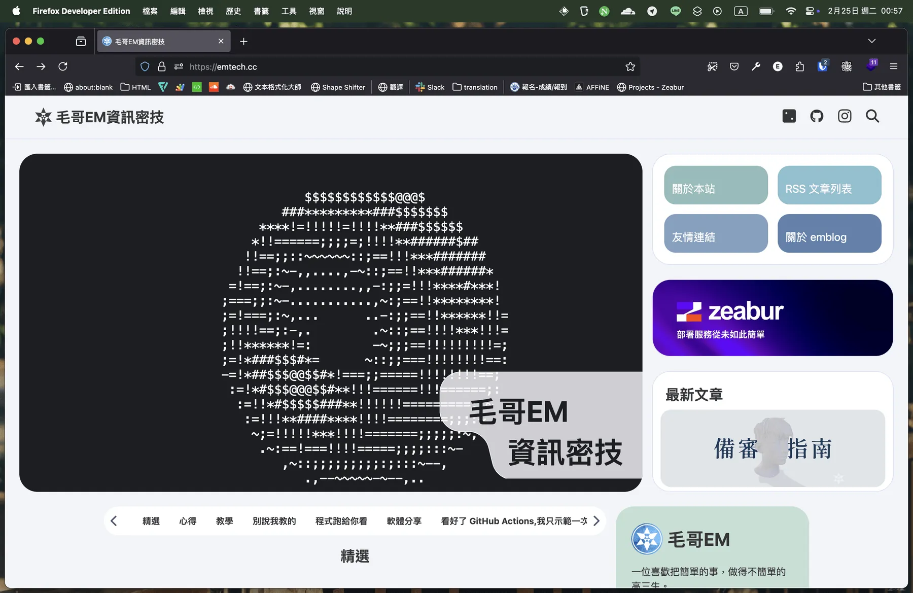

# 從 Windows 轉到 MacBook 的心得

今年入手了人生第一台筆電，是最新的 M4 MacBook Pro。從小沒摸過幾次 MacOS，一直以來都是 Windows 的使用者。但從開發問題、自動更新、內建病毒 Windows Defender 到躲不掉的各種廣告，讓我對 *Windows ™*有很多不滿。加上考慮到未來可能會開發 iOS App，所以就決定*強力出圈*入手 MacBook。今天我想來*坐和放寬*的分享一下這個轉換過程，以及我的一些做法來提升我的效率，讓失去的那些 Windows 習慣找回來。

## 背景

這三年我最常使用的是學校的 [Dell Latitude 7400](https://www.dell.com/support/manuals/zh-tw/latitude-14-7400-laptop/lat7400_setup_specifications/%E5%A4%84%E7%90%86%E5%99%A8) 筆電。我覺得用起來很順手，*窗*我也摸得很熟。這台筆電的設計我覺得很不錯，雖然是塑膠外殼是那種有點毛茸茸的感覺，很舒服。他的觸控板也真的很好用，長得有點像 ThinkPad 觸控板 180 度反過來，摸起來有一點阻尼感很穩但又很輕鬆舒服。是我人生中用過最好用的觸控板，我平常也都不外接滑鼠的。3 個 USB-A，一個 USB-C 可以 65w 充電，還有 SD 卡槽，總之這應該是我人生中用過最舒服的筆電了。

i5 第八代，256GB SSD，還算夠用。雖然只有內顯但還是常常被我跑 [Blender](https://www.blender.org/), [Whisper](https://github.com/openai/whisper), [Adobe Illustrator](https://www.adobe.com/tw/products/illustrator.html) 之類的東西。唯一的缺點是記憶體只有 8GB，很容易多開點東西就爆，開個 Photoshop 就會變烤吐司機。後來我後來有自己加了一條 16GB 的記憶體進去舒服多了（很不錯竟然有兩個記憶體插槽）。不過馬上也要畢業了，也要上大學了，確實也需要台筆電。高二的時候我媽有主動提議如果上頂大就幫我買一台 MacBook，我也就答應了，然後沒想到也上了交大，所以就買了這台 MacBook Pro。

> 「開新，超開心」——iPhone 15 宣傳語

## 德誼數位

因為正好我的手機門號要到期了，而某一次經過時問了一下發現德誼數位可以直接幫遠傳續約，搭配 iPhone 或 MacBook 都有折扣。而且跟學生方案不衝突，所以等到交大放榜之後過了幾天我們就去辦了。

考慮到我的使用需求，我選擇了 14 吋的太空黑色 M4 Pro 款 MacBook Pro，規格是 12 核心 CPU、16 核心 GPU、24GB 記憶體、512GB SSD，這個規格對我來說應該夠用了。實際上的價格大概是`大學生教育優惠價` - `遠傳續約優惠` - `信用卡 3% 回饋` - `Sogo 會員返回點數`再加上號稱值 4990 的贈品。這樣算下來也是省了一萬多，還算是蠻划算的。

送的禮物有一個筆電側背包，一個 USB Hub ([Hub A01m](https://storetw.adamelements.com/product?saleid=2303090008&colorid=GY))，一個螢幕保護貼，一個鍵盤膜。實際在使用時用到第一天就把鍵盤膜扔了，因為套著打真的很不舒服，而且因為距離變近了螢幕也容易髒。第二天螢幕保護貼撕了，因為我覺得變模糊而且反光很嚴重。我開視覺化工作室程式碼（[Visual Studio Code](https://code.visualstudio.com/)）寫程式的時候我的臉比程式碼都還要清楚。USB Hub 很好用，很快很穩。

如果你們要買 Macbook 的話，可以考慮一下德誼數位看看有沒有活動。這次他們的服務態度很好，而且有很多優惠。不過要注意一下搭配的方案，如果不是選不降速吃到飽的話要注意一下降速後的網速。像我就當時沒看清楚在著急下就選了 399 的方案，回家仔細看是降到 128Kbps，我原本每個月 149 的方案降速後還有 1Mbps。

> 這裡要特別感謝 Each Chen 來跟我一起買讓我有大學生優惠。

## 硬體配置

先來講一下硬體方面。MacBook 包裝好看，外觀好看（跟上一代完全相同）這不用說。我選的是黑色的我覺得非常好看，很有科技感。白色不知道為什麼我會有那種從小看到螢幕背後 Logo 還會發光的星巴克氣氛組的陰影的感覺。

> 攝像頭、顯示屏、性能，樣樣 Pro 如其名。 ——Apple 宣傳語

### 鍵盤

剪刀鍵盤真的很好打，很舒服，手感很好。鍵程短，沒有段落感但很有回饋感。不會有傳統薄膜鍵盤那種黏黏肉肉的感覺，長時間打也不會累。

沒外接過鍵盤。

### 觸控板

蘋果觸控板是出了名的好用。我一直都很喜歡用觸控板，原本 Dell 的就超好用，我甚至可以直接拿來玩 Minecraft。蘋果的我覺得跟 Dell 的不相上下，各有優缺。Dell 的有實體按鍵可以雙手操作很方便：左手大拇指按左右鍵，右手類似搖桿只移動。但用 Mac 之後左手的大拇指就很忙了，所以就一定要右手用力按下去，多用一下習慣就好了。蘋果的觸控板真的很大很漂亮，但我習慣靈敏度開大點，又加上有加速度，所以對我影響不大。

總之把靈敏度提高、按下的壓力開到最輕之後用的蠻順手的。沒外接過滑鼠。

### 螢幕

顏色真的漂亮。如果在房間會外接兩個螢幕（原本 PC 用的，一個 1080P 一個 4K），三螢幕工作很爽。因為 4K 的螢幕在我正前方所以我有拿一個收納盒把螢幕墊高，不然下面會被我的 MacBook 遮住。這樣有點老人但真的舒服多了。看過很多人會把 MacBook 合起來像 Switch 一樣放在旁邊，但我覺得有這麼好的鍵盤、滑鼠、螢幕、喇叭、鏡頭為什麼不用。

### 喇叭

MacBook 的音質真的很不錯，我有被驚艷到。高音很細膩，低音很給力。而且音場設計的很好，坐在正前方跟旁邊、對面會差很多。雖然我的房間是有喇叭的，但我現在都直接用 MacBook 的內建喇叭。

> 「AirPlay 揚聲器，讓他盡情搖擺。」——Apple 父親節廣告郵件

### 晶片與散熱

日常使用沒聽過風扇轉過，也從來沒有卡過，外殼一直都很冰冷。唯一聽過一次風扇轉是拿來測試 Whisper 跑 AI 語音辨識的時候，跑的速度也是很快。對了除了更新以外好像也從來沒關過機。

哦對了唯一想抱怨的只有邊框切得蠻鋒利的，掀起螢幕跟把手放在邊緣會有點割手，但我覺得這樣的設計很好看，也還算能接受的範圍。

> 「快得太嚇人。」——Apple MacBook 宣傳語

{{notice}}

2025/2/26 補充

我補充一下，最近我回學校又開始使用學校的電腦。馬上開始想念我的 MacBook 了。好卡，不能單手開，打字好痠好黏，`Ctrl` 鍵按幾分鐘手就酸了。然後快捷鍵一直按錯，拿 `caps lock` 在切語言，`，` 打成 `<`，拿 `ctrl + backspace` 當 `delete`。

Mac 版 Office 全家桶真的 UI 很好，UX 比 Windows 還糟糕好多。

{{noticed}}

## 轉換過程

可能是之前有用過一點點老師朋友的 Mac 的關係，大概一分鐘操作就上手了。很多東西花了點時間慢慢習慣，不能習慣或沒有的功能就用軟體解決。

### 軟體

用了 MacBook 之後幾個軟體我嘗試比較後用回了內建的方案：

- **行事曆：** 網頁版 Google Calendar ⇀ 行事曆
- **郵件：** Thunderbird ⇀ 郵件
- **查看 PDF：** Firefox ⇀ 內建預覽
- **搜尋：** Everything ⇀ 內建搜尋

還有幾個軟體因為沒有 Mac 版，所以找到一些替代軟體：

- [7-Zip](https://www.7-zip.org/) ⇀ [Keka](https://www.keka.io/zh-tw/)：開源免費好用的解壓縮工具
- [終端機](https://github.com/microsoft/terminal) / [MobaXterm](https://mobaxterm.mobatek.net/) ⇀ [iTerm](https://iterm2.com/)：強大好看的終端機
- [Chocolatey](https://chocolatey.org/) ⇀ [Homebrew](https://brew.sh/)：Mac 的套件管理工具

哦對了，現在備忘錄變成像是 Windows 記事本一樣我隨手拿來當文字編輯器的工具。其他平常工作的軟體都沒有變化，在 MacOS 上面都通用。

然後我也安裝了 VMware Fusion 來跑 Windows 虛擬機，不過目前還沒有用到過。

### 快捷鍵：單手炫大招

Mac 的鍵盤相信如果你是第一次看到你都會傻住。從左到右分別是 fn、control、option、command、空白。Windows 則是 control、fn、windows、alt、空白。很多人會覺得很疑惑，Windows 一個 control 就打片天下了 Mac 為什麼那麼複雜，但其實你仔細數就會發現其實快捷鍵的數量是一樣的，只是需要記一下。

你可以簡單這樣理解：

- Windows 的 `control` 大多情況就是 Mac 的 `command`，像是 `command + c` 是複製，`command + v` 是貼上。
- 但是 Mac 有一些內建作業系統的快捷鍵會佔用 `command`，像是 `command + H` 來最小化視窗，`command + M` 來隱藏視窗丟一旁，會把一些軟體原本的快捷鍵搶走。不像 Windows 跟作業系統有關的快捷鍵通常是 `windows` 加上數字或字母，或著是其他複雜的組合。
- 有些軟體選擇擺爛，就直接不給那些快捷鍵了，有些就找找替代方案。
    - 瀏覽器歷史紀錄不能用 `command + H` 了，要用 `command + Y`。
    - 切換分頁不能用 `command + tab`，因為 `command + tab` 是切換應用程式，這時又換回 `control + tab` 了。
    - 切換語言不能用 `command + space` 了，因為 `command + space` 是啟動 Spotlight，這時又換回 `control + space` 了。
- Mac 沒有很多 Windows 有的按鈕，像是 `home`、`end`、`insert`、`delete`，所以你要用 `command + 左右方向鍵`、`command + 上下方向鍵`、`fn + delete` 這些組合來代替。不過不常用且還算直覺，手也不用離開鍵盤。
- Mac 有很多很奇耙會讓你手打結還按不出來的快捷鍵，像是 VS Code 新增檔案室 `command + option + control + N`，不過目前覺得這種都不常用，不用浪費腦細胞記。

Mac 在檔案管理方面的快捷鍵我覺得蠻有趣的。當我想重新命名檔案時按下 `F2` 時沒反應。當我想打開來看時按下 `return`(aka `enter`)，結果沒打開，反而是重新命名。當按下 `command + O` 時才會打開。當我想要預覽時不像 Windows 是 `control + space`，`option + space` 是全螢幕預覽，結果才發現原來是最簡單的直接按空白。

總結一下：重新命名 `return`、預覽 `space`，習慣一下反而更直覺簡單了。這個規則也同樣適用於 VS Code。

{{notice}}

小提示

如果你 Windows 快捷鍵只會用 `control + c`、`control + v`，那麼...你已經勝過很多學校老師了。

也許你知道 `windows` 加上數字和字母有多少快捷鍵、`alt` 有多好用之後你會更...喜歡工作（？）我在國二的時候寫過一篇[快捷鍵分享你可讀讀](https://emtech.cc/p/windows-hotkey)，不過裡面講的不多。

{{noticed}}

#### 輸入法

講到輸入法，我目前只有使用注音輸入法，又有一顆中英切換鍵，所以沒有切換輸入法的困擾，也沒有誤按 `shift` 的問題。反正我用 Windows 的時候應該從來沒開過 Caps Lock，拿來當中英切換鍵也是很好的。畢竟在中文書入法如果直接按著 `shift` 會變成全形的大寫英文，所以還是得切回英文輸入法在打。有點困擾但還行。

#### Karabiner-Elements

> 「重新編排，事事好安排。」——Apple MacOS Catalina 介紹

MacOS 雖然給的快捷鍵很多，但很多我平常非常常用的反而沒有。像是 `Windows + 數字` 來開啟工作列的應用程式，`Windows + E` 來開啟檔案總管，`Windows + D` 來最小化所有視窗等等。有一些有更好的替代方案，有一些可以放棄，但有一些我真的需要。上網搜尋找到了一個叫做 [Karabiner-Elements](https://karabiner-elements.pqrs.org/) 的軟體來幫我重新編排快捷鍵。

查看例子，明確樣子。我自己目前設定了以下幾個：

- F3 打開 Finder
- `option + ~` 打開記事本
- `option + 1` 打開 Firefox（開發時水狐狸還是比 Safari 好用）
- `option + 2` 打開 VS Code
- `option + 3` 打開 Discord
- `option + 4` 打開 iTerm (Terminal)
- `option + 5` 打開 AFFiNE（Markdown 筆記軟體）

`option` 鍵加上數字或字母預設是打出一些符號，但這實在太少用而且還要自己記，所以正好全部可以拿來給我當快捷鍵。哪天如果真的要打那些符號也有右邊的 `option` 不影響。不過有一些軟體像是 Figma 就會拿 `option` 來當 `alt` 來做一些快捷鍵，如 `alt + h` 是水平置中，所以會需要注意一下。

#### Spotlight - Raycast

從在使用 Windows 的時候我就很習慣 Spotlight 的這種操作方式了。我開軟體都是直接用搜尋來開軟體，像是如果要打開 VS Code 我就依序按下 `windows`、`v`、`enter` 這三顆就打開了。這樣比在桌面或是應用程式列表中慢慢找快多了。

{{notice}}

小提示

Windows 中要開啟搜尋不需要點那個又長又醜的 Search Bar。只需要按下 `windows` 鍵然後直接打字就可以開啟搜尋了。

這麼說那個搜尋框是不是很沒用？沒錯，你可以在個人化設定中把它隱藏。

{{noticed}}

但 Spotlight 的功能有限，你不能把它當作像 GPT 個人助理一樣進行各種進階的操作，因此我被好幾個朋友推薦 [Raycast](https://www.raycast.com/)。Raycast 簡單來說就是 Spotlight Pro Max，有更多的功能，更多的自訂性。先不講擴充功能，光是計算機就讓我愛不釋手了。

Raycast 內建就有很多很方便的軟體以及快捷鍵，像是可以搜尋各種圖標的 emoji 鍵盤 `control` + `command` + `space`。你可以安裝甚至自己開發各種擴充功能來符合你的工作流程。

我目前已經把內建的 Spotlight 停用，完全用 Raycast 來取代。

#### 桌面管理

Mac 的桌面管理...很藝術，很有他的想法。我們來一個個討論。

##### 視窗按鈕

視窗那三顆按鈕很小很難按但對我來說超級少用到，我都是直接用快捷鍵 `cmd` + `w`、`cmd` + `q`、`cmd` + `h` 來關閉視窗，還有前面講到的那些快捷鍵來控制，所以他在那裡好看真的比較重要。

`cmd` + `q` 真的蠻不錯的，可以完全關掉不會像 Windows 一樣在背景跑。

##### 全螢幕

我自己一直是一個多桌面、多螢幕使用者，但 Mac 的全螢幕真的是一個很玄的設計。任何全螢幕的視窗都會變成一個獨立的桌面，好這已經夠神奇了，重點是這時候不能有任何其他視窗疊在上面。比如說我在 VS Code 全螢幕寫文章想從 Finder 丟一個檔案進來，抱歉不行。這時候你只能把 VS Code 縮小，然後把 Finder 縮小，然後把檔案拖進 VS Code，然後再把 VS Code 放大。

好那我就不要放全螢幕不就好了？反正我在 Windows 也不會按 F11 來用軟體。現在 Mac 終於可以自己管理視窗大小，不用 [Magnet](https://magnet.crowdcafe.com/) 這種軟體來做到左右分屏、四分屏、上下分屏等等。但用像 Windows 一樣把視窗拖到最上面（或著是用反人類的快捷鍵 `fn` + `control` + `f`）的效果如下：

我們放大點看：

你跟我說這叫全螢幕？這看起來超難受。這時我發現 Raycast 內建就有視窗管理工具。我把全螢幕跟縮小放中間分別設定成 `option` + `z` 跟 `option` + `shift` + `z`，這樣就可以優雅的全螢幕了。對了而且喔這個全螢幕的大小跟使用預設的 `control` + `command` + `f` 大小其實是一樣的。差別只是全螢幕最上面的狀態欄變成黑色的。就這樣。因為 MacBook 有瀏海所以那一排都不能給軟體顯示。

> "Only Apple can do" ——Tim Cook

## 總結

MacBook Pro 整理來說真的是一台非常好用的筆電，我非常滿意。硬體設計非常好，軟體也很穩定，使用起來很順手。當然，我才使用三個月不到，所以期許還有更多功能等著我去發掘。也期待從今年開始可以帶著他經歷大大小小的活動。

{{notice}}

備註

- 封面圖素材來自 Apple 官網
- 「真的，就很你。」來自 iOS 18 宣傳語、「單手炫大招」來自 iPad Mini 宣傳語、「強力出圈」來自 iPhone 14 Pro 宣傳語
- 「坐和放寬」來自 Windows 10 預覽版更新 Build 10041：「你的電腦將重新啟動多次。坐和放寬」

{{noticed}}
